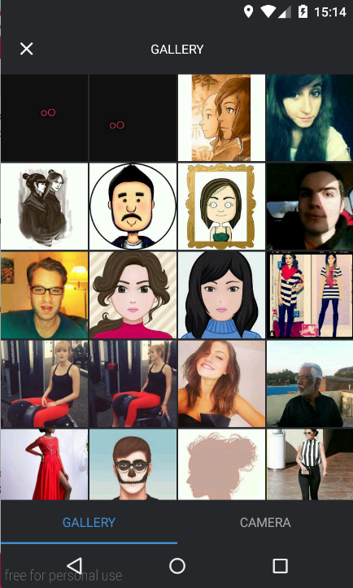
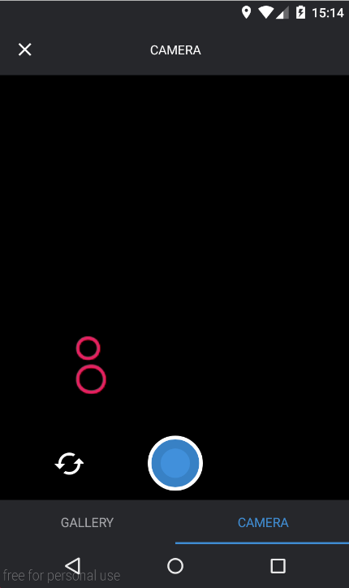

#What is SingleImagePicker?

SingleImagePicker is image selector library for android that allow you select single image.<br />
Do not waste your time for write image select function code. You can take a picture or select image from gallery.<br />

Also you can customize color, drawable, etc for your application.

I use cwac-cam2 for take a picture.

## Demo
 

       

##Setup

#####Gradle
```javascript
repositories {
    mavenCentral()
}

dependencies {
      compile 'com.loyalsound:android-single-image-picker:0.0.1'
}
```

#####Permission
Add permission for Camera, External Storage.

```javascript

<uses-feature android:name="android.hardware.camera" />
<uses-feature android:name="android.hardware.camera.autofocus" android:required="false" />

<uses-permission android:name="android.permission.CAMERA" />
<uses-permission android:name="android.permission.WRITE_EXTERNAL_STORAGE" />

```

#####Activity
Declare Activity in your `AndroidManifest.xml`

```javascript
<activity
        android:name="com.ls.sip.ImagePickerActivity"
        android:screenOrientation="portrait"
        android:theme="@style/Sip.Theme" />
```

If you want to customize theme, just simply extend original theme like this.
ImagePickerActivity use toolbar without actionbar
```javascript
<style name="MySipTheme" parent="Sip.Theme">
    
    <item name="sipBackgroundColor">@color/sip_background_color</item>
    <item name="sipTitleTextColor">@color/sip_title_text_color</item>
    <item name="sipTabTextColor">@color/sip_tab_text_color</item>
    <item name="sipTabSelectedTextColor">@color/sip_tab_selected_text_color</item>
    <item name="sipButtonTextColor">@color/sip_button_text_color</item>

    <item name="sipTabStyle">@style/Sip.Theme.TabStyle</item>
    <item name="sipTitleTextStyle">@style/Sip.Theme.TitleTextStyle</item>

</style>
```


##How to use

#####1. Start Activity
Add your request code for `startActivityForResult()` and start `ImagePickerActivity`

```javascript
private static final int INTENT_REQUEST_GET_IMAGES = 13;

private void chooseImage() {

    Intent i = new ImagePickerActivity.IntentBuilder(MainActivity.this).build();
    
    startActivityForResult(i, INTENT_REQUEST_GET_IMAGES);

}
```


#####2. Receive Activity
If you finish image select, you will recieve image path array (Uri type)
```javascript
@Override
protected void onActivityResult(int requestCode, int resuleCode, Intent intent) {
    super.onActivityResult(requestCode, resuleCode, intent);

    if (requestCode == INTENT_REQUEST_GET_IMAGES && resuleCode == Activity.RESULT_OK ) {

        Uri selectedImageUri = intent.getData();

        //do something
    }
}
```

## Contributions
* Thanh Nguyen [@9you](https://github.com/9you)

## Thanks
* [CWAC-Cam2](https://github.com/commonsguy/cwac-cam2) - Taking Pictures. Made Sensible.
* [Glide](https://github.com/bumptech/glide) - An image loading and caching library
* [Ted Park](https://github.com/ParkSangGwon/TedPicker) - Original project

## License 
```
Copyright 2016 LoyalSound Inc.

Licensed under the Apache License, Version 2.0 (the "License");
you may not use this file except in compliance with the License.
You may obtain a copy of the License at

http://www.apache.org/licenses/LICENSE-2.0

Unless required by applicable law or agreed to in writing, software
distributed under the License is distributed on an "AS IS" BASIS,
WITHOUT WARRANTIES OR CONDITIONS OF ANY KIND, either express or implied.
See the License for the specific language governing permissions and
limitations under the License.```
```